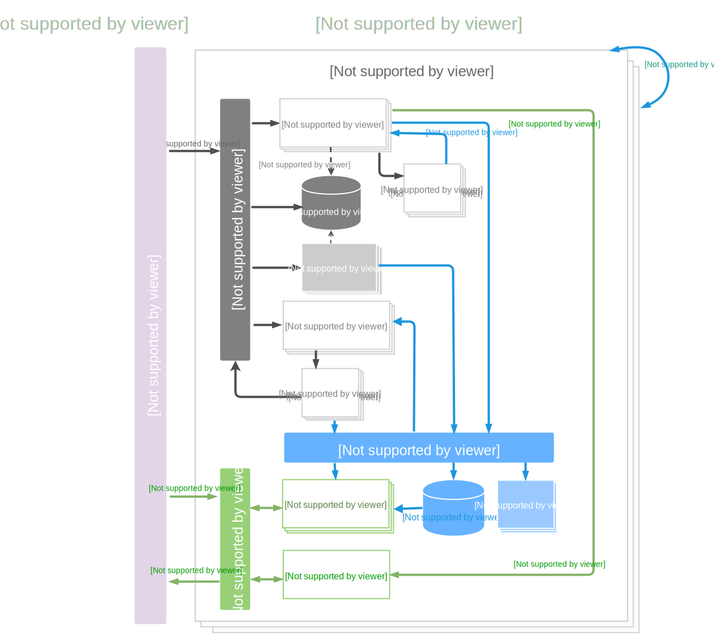

# Spine Event Engine Concepts

 This chapter introduces some key architecture concepts we use in Spine Event Engine.
 It assumes that you've read the [Introduction](README.md). 
The Diagram below represents an architecture of the application built with Spine Event Engine.

Spine provides realization for most important building blocks of the CQRS Event Sourced application. In terminology we heavily lean on Domain-Driven Design(DDD) [“big blue book”](http://www.amazon.com/Domain-Driven-Design-Tackling-Complexity-Software/dp/0321125215) and [CQRS Jorney](https://msdn.microsoft.com/en-us/library/jj554200.aspx).  

##Write side
**Command** is an instruction to do something. Commands are messages that instruct a specific entity to perform a certain action.They are named with a verb in the imperative mood plus and may include the aggregate type. Unlike an event, a command is not a statement of fact; it's only a request, and thus may be refused. (A typical way to convey refusal is to throw an exception).In Spine [command](/java) is defined as a protobuf message. 

**Event** is something that happened in the past.
Capture all changes to an application state as a sequence of events. In Spine events are defined as protobuf messages. Find out more about [Writing an Event] .

**Aggregate** handles commands, applies events, and have a state model encapsulated within it that allows it to implement the required command validation, thus upholding the invariants (business rules) of the aggregate.
Read more on declaring an [Aggregate](/java/aggregate.md) in Spine.

**Aggregate Repository** manages Aggregates, sends events to Event Bus and latest Aggregate States to the Aggregate Stand.

**Command Bus** is responsible to routing the command to its handler. Unlike Command Handler it does not change business model or produce events.

**Command Handler** receives and validates commands, executes the required actions. 
Command Handler changes the state of the business model and produces corresponding events, which are then written to the Event Store. It also writes status to Command Store.

**Command Store** receives commands from the Command Bus and writes command statuses coming from Aggregate Repository and Command Handler.

** Process Manager** coordinates and routes messages between bounded contexts and aggregates. You may find a broader explanation of this term  in [CQRS Journey](https://msdn.microsoft.com/en-us/library/jj591569.aspx) book. A process manager gives a single place where the routing is defined.

**Process Manager Repository** manages communications between Command Bus and Process Manager. It also processes events from the Event Bus.

**Event Bus** allows publish-subscribe-style communication between components without requiring the components to explicitly register with one another (and thus be aware of each other).

** Event Handler** accepts the type of the event as the first parameter and Event Context as the second parameter;

  **Event Store. ** Events generated by the Aggregates as a result of commands that change state are written to an Event store. Event Store communicates with Projection Repository by sending events in response to the
  
  ## Read Side
  ** Aggregate Stand ** is called that way to emphasize its _“read”_ nature. It provides service similar to what Stream Projection does, the Aggregate Stand would return complete instances of aggregate states, or their projections upon queries from users.

**Projection.** Objects that subscribe to a stream of events in the system, and provide a view of these to the application. Stream Projection Repository manages Projections.

**Query Service**. Aggregate Stand Service and Stream Projection Repositories are linked to the Query service, and the Query Service would read data from them, then passing it to the client.

For language-specific details, see the [Getting Started](/Getting Started/README.md).